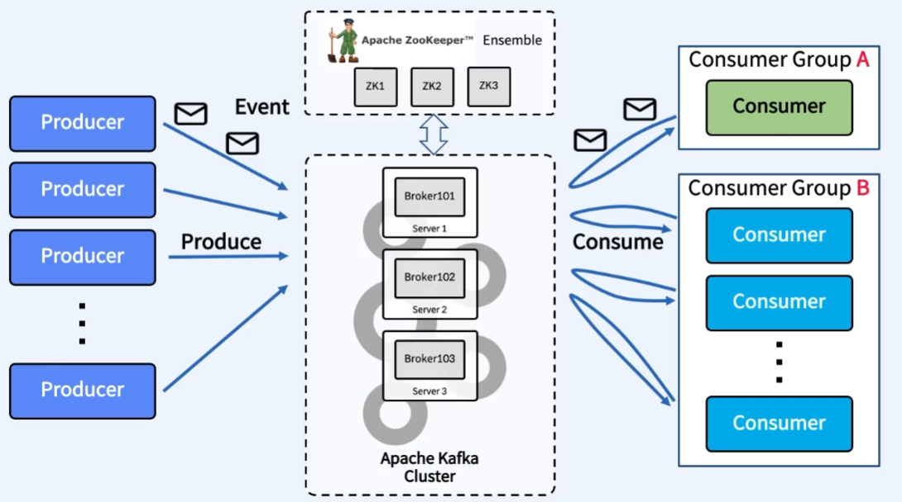
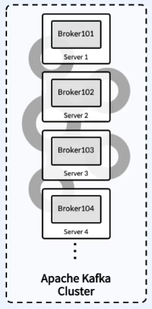
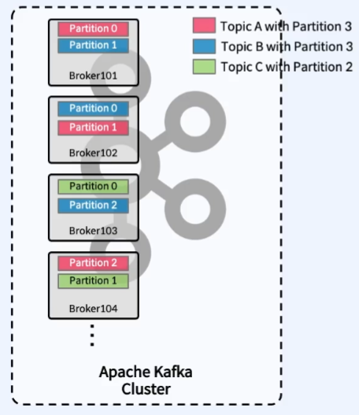
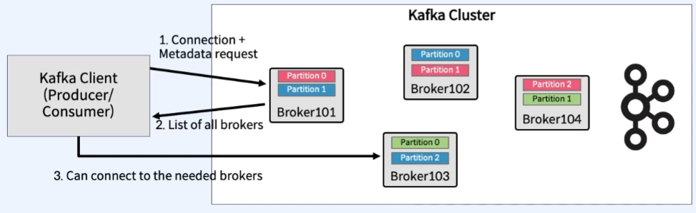
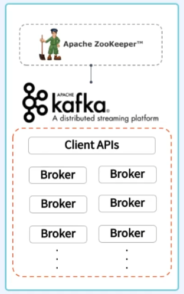
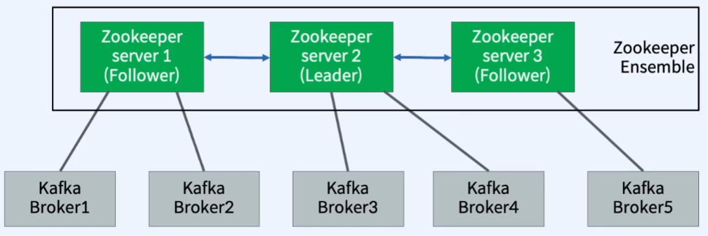

# 03. Broker, Zookeeper

## 1. Apache Kafka 주요 요소

---

## 2. Broker

### 1) Broker란?

- Partition에 대한 Read 및 Write를 관리하는 S/W
- `Kafka Server`라고 부르기도 함
- Topic 내의 Partition 들을 분산, 유지 및 관리
- 각각의 Broker들은 ID로 식별됨 `(단, ID는 숫자)`
- Topic의 일부 Partition들을 포함
  - Topic 데이터의 일부분(Partition)을 갖을 뿐 데이터 전체를 갖고 있지 않음
- `Kafka Cluster` : 여러 개의 Broker들로 구성
- Client는 특정 Broker에 연결하면 전체 클러스터에 연결됨
- `최소 3대 이상`의 Broker를 `하나의 Cluster`로 구성해야 함
  - `4대 이상을 권장`함

### 2) Broker와 Partition의 관계

- Broker ID와 Partition ID 간에는 아무런 관계가 없음
- Topic을 구성하는 Partition들은 여러 Broker에 분산
- Topic 생성 시 `Kafka가 자동으로 해당 Topic의 Partition을 모든 Broker에게 할당하고 분배함`

### 3) Bootstrap Servers

- Kafka Cluster를 Bootstrap 서버라고 부름
  - Client는 하나의 Broker에만 연결하면 Cluster 전체에 연결됨
    - 하지만, 특정 Broker 장애를 대비하여 전체 Broker List(IP, Port)를 파라미터로 입력 권장
  - 각각의 Broker는 모든 Broker, Topic, Partition에 대해 알고 있음(Metadata)

---

## 3. Zookeeper

### 1) Zookeeper란?

- Zookeeper는 Broker를 관리(Broker 들의 목록/설정)하는 S/W
- Zookeeper는 변경사항에 대해 Kafka에 알림
  - Topic 생성/제거
  - Broker 추가/제거
- Zookeeper 없이는 Kafka가 작동할 수 없음
  - 2022년에 Zookeeper를 제거한 정식 버전 출시 예정
- Zookeeper는 홀수의 서버로 작동하게 설계됨 (최소 3, 권장 5)
- Zookeeper는 Leader(Write)가 있고 나머지 서버는 Follower(Read)

### 2) Zookeeper Architecture

> Leader/Follower 기반 Master/Slave 아키텍처

- Zookeeper는 분산형 Configuration 정보 유지, 분산 동기화 서비스를 제공하고 대용량 분산 시스템을 위한 네이밍 레지스트리를 제공하는 S/W
- 분산 작업을 제어하기 위한 Tree 형태의 데이터 저장소
  - Zookeeper를 사용하여 멀티 Kafka Broker들 간의 정보(변경 사항 포함) 공유, 동기화 등을 수행

### 3) Zookeeper Failover

> Quorum 알고리즘 기반

- `Quorum(쿼럼)`은 "`정족수(과반)`"이며, 의결을 하는데 필요한 최소 한도의 인원수를 뜻함
- 분산 코디네이션 환경에서 예상치 못한 장애가 발생해도 **분산 시스템의 일관성**을 유지시키기 위해 사용
- Ensemble이 3대로 구성되었다면 `Quorum`은 `2`, 즉 `Zookeeper 1대`가 장애가 발생해도 정상 동작
- Ensemble이 5대로 구성되었다면 `Quorum`은 `3`, 즉 `Zookeeper 2대`가 장애가 발생해도 정상 동작
- `Quorum` 알고리즘 기반으로 Failover를 다루기에 `Zookeeper는 홀수 개로 구축`
