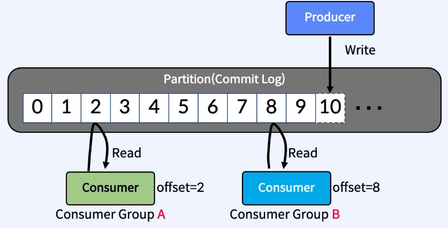
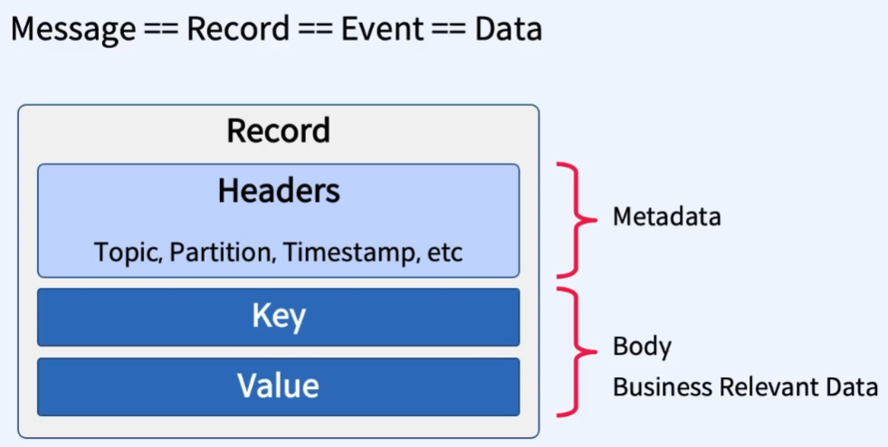
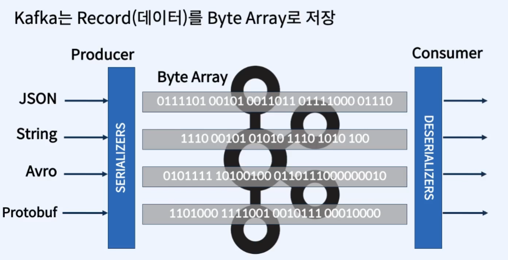
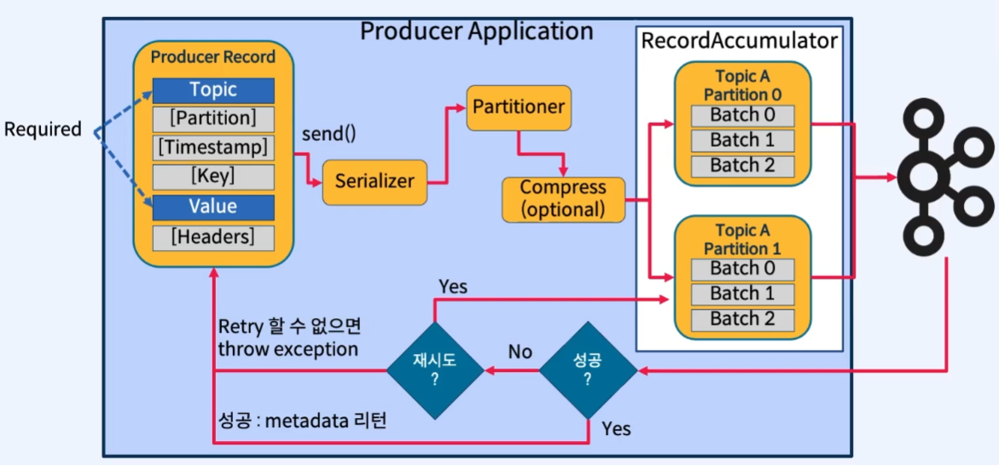
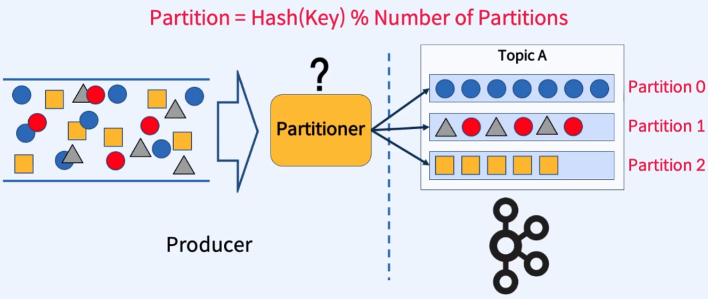
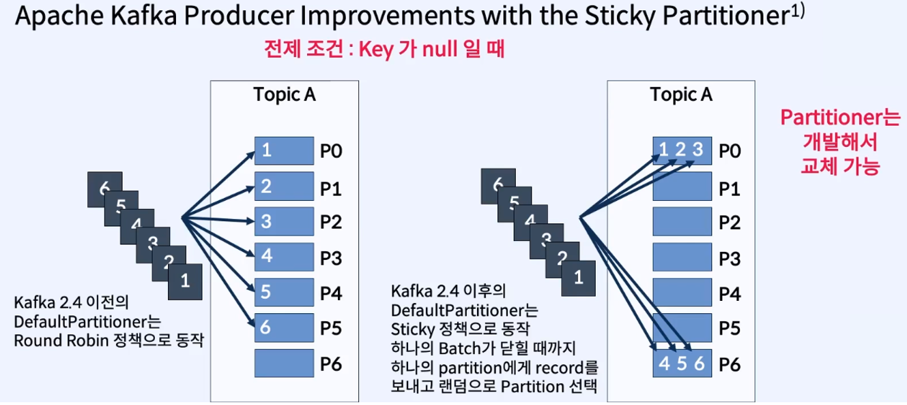

# 04. Producer

## 1. Apache Kafka Clients

> `Kafka`의 `Client`에는 `Producer`와 `Consumer`가 있다

### 1) Producer, Consumer, Consumer Group

- `Producer` : 메시지를 생산(Producer)하여 `Kafka`의 `Topic`으로 전송하는 Application
- `Consumer` : `Topic`의 메시지를 가져와(Consumer) 사용하는 Application
- `Consumer Group` : `Topic`의 메시지를 사용하기 위해 협력하는 `Consumer`들의 집함
- 하나의 `Consumer`는 하나의 `Consumer Group`에 포함되며, `Consumer Group`내의 `Consumer`들은 협력하여 `Topic`의 메시지를 병렬 처리

### 2) Producer와 Consumer의 기본 동장 방식

- `Producer`와 `Consumer`는 서로 알지 못함
- `Producer`와 `Consumer`는 각각 고유의 속도로 `Commit Log`에 `Read/Write` 수행
- _다른 `Consumer Group`에 속한 `Consumer` 들은 서로 관련 없으며, `Commit Log`에 있는 Event(Message)를 동시에 다른 위치에서 `Read`할 수 있음_

 

---

 

## 2. Record(Message) 구조

> Message = Record = Event = Data

 

- Message 는 `Header`, `Key`, `Value` 구조를 가짐
- `Header`는 `Metadata(Topic, Partition, Timestamp, etc)`를 가짐
- `Key`, `value`는 비즈니스 데이터를 가짐
  - `Avro`, `JSON`, `String` 등 다양한 형태로 가능

 

---

 

## 3. Kafka는 Data를 Byte Array로 저장

- `Producer`는 `JSON`, `String`, `Avro`, `Protobuf` 등의 데이터를 `Serialization(직렬화)`하여 **`Byte Array`** 로 전환(저장)
- `Consumer`는 **`Byte Array`** 를 `Deserialization(역직렬화)`하여 `JSON`, `String`, `Avro`, `Protobuf` 등의 데이터로 전환하여 사용

 

---

 

## 4. Producing to Kafka

 

[Producer의 작동 과정]

1. `Producer`가 `Message` 생성
   > - 개발자 입장에서, `Producer`에서 `send()`메서드만 호출하면 뒤의 과정들은 자동으로 진행하여 `Kafka`로 전송
   > - 실제로 메시지 전송을 관여하는 객체는 `Sender`와 `RecordAccumluator`
2. `send()`메서드로부터 `Kafka Cluster`에서 `Topic` 관련 최신 `Metadata`를 `Fetch`한다.
   > - `send()` 메서드는 **`비동기`**
   > - `waitOnMetadata()` 메서드를 호출하여 최신 `Metadata`를 `Fetch`한 뒤 `ProducerMetadata` 상태를 갱신
3. `Message`의 `Serialization` 진행
4. `Partitioner`에 의해 어떤 `Partition`으로 갈지 정해짐
5. 필요에 따라 압축(Compress) 진행
6. `Buffer` 역할을 하는 `RecordAccumulator 객체(Accumulator)`에 `Batch` 형태로 메시지를 저장한다(모은다).

   - `Message`가 생성될 때마다 `Broker`로 전달하는 것은 **`Network I/O`의 `오버헤드`** 발생
   - **Network 비용을 줄이기 위해** `Batch` 형태의 묶음으로 저장

   | 옵션                        | 설명                                                                                                                                                               |
   | --------------------------- | ------------------------------------------------------------------------------------------------------------------------------------------------------------------ |
   | `batch.size` (default 16kb) | size를 정의 하여 메세지의 용량이 size에 도달 할 때 까지 기다렸다가 보낸다.                                                                                         |
   | `linger.ms` (default 0)     | batch.size가 도달하지 않으면 메세지를 보내지 않기 때문에 마냥 기다릴 수는 없어 해당 시간을 설정하여 size가 도달하지 않더라도 시간이 초과하면 메세지를 보내게 된다. |

7. `Sender`를 통해 `I/O Thread`에서 주기적으로 `Accumulator`의 메시지들을 `Kafka`로 전송
8. 만약, 전송이 실패됐다면 `retry` 진행
9. 만약, `Retry`가 정해진 횟수만큼 반복되면 `throw Exception` 진행

 

---

 

## 5. Partitioner

> - `Topic`의 메시지를 어떤 `Partition`으로 보낼지 결정하는 알고리즘
> - `Key`의 존재 여부에 따라 알고리즘이 다름
> - `Customizing` 가능

 

### 1) Key가 Null이 아닐 때의 Default Partitioner

 

- `Key`값이 `Null`이 아닐 때의 `Default Partitioner` 알고리즘은 `Key` 값의 `Hashing` 및 `modular` 연산을 통해 어떤 `Partition`으로 보낼지 결정
- 만약 새로운 `Partition`이 추가된되면, 분배에 대한 `일관성`을 잃음

 

### 2) Key가 Null일 때의 Default Partitioner (Sticky Partitioner)

 

- `Key`가 `Null`일 때의 경우 `Default Partitioner`는 `Apache Kafka 2.4` 전후로 나뉜다.
  - Kafka 2.4 이전 : _`Round Robin`_ 방식
  - Kafka 2.4 이후 : _`Sticky Partitioner`_ 방식
  - 알고리즘이 바뀐 이유 : `Batch` 형태의 메시지를 보낼 때 메시지가 다 담겨지기 전에 보내지는 현상이 있어 Kafka 2.4 이후부턴 `Batch`가 다 담겨질 때까지 `Partition`을 채운 후 전송한다.
  - 장점
    - 효율적인 `resource` 사용
    - `Kafka`로 보내는 `Request(Network I/O)`를 줄일 수 있기에 `Broker` 입장에서 처리량이 줄어든다.
  - 참고: [https://www.confluent.io/blog/apache-kafka-producer-improvements-sticky-partitioner/]
- `Producer`는 `Partition`에 Data를 전송하기 전에 `Accumulator`에 `buffer`로 쌓은 후 발송
