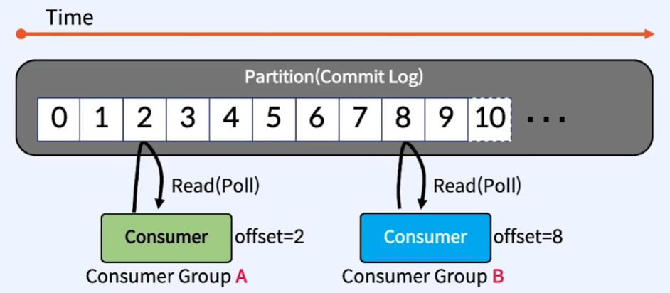
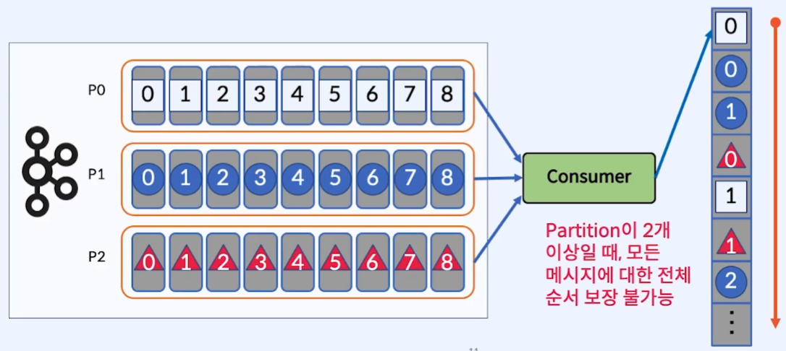
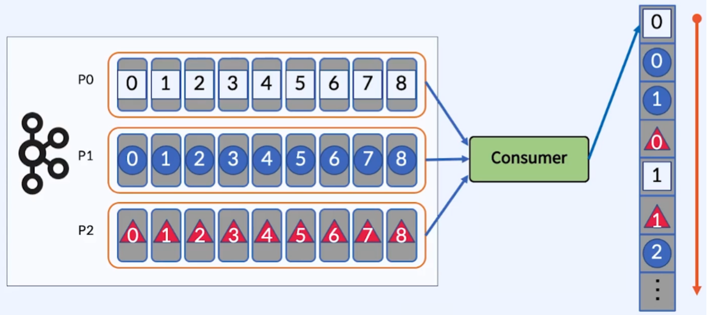
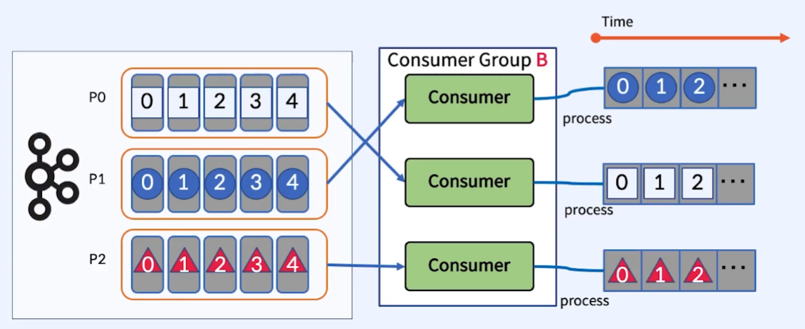
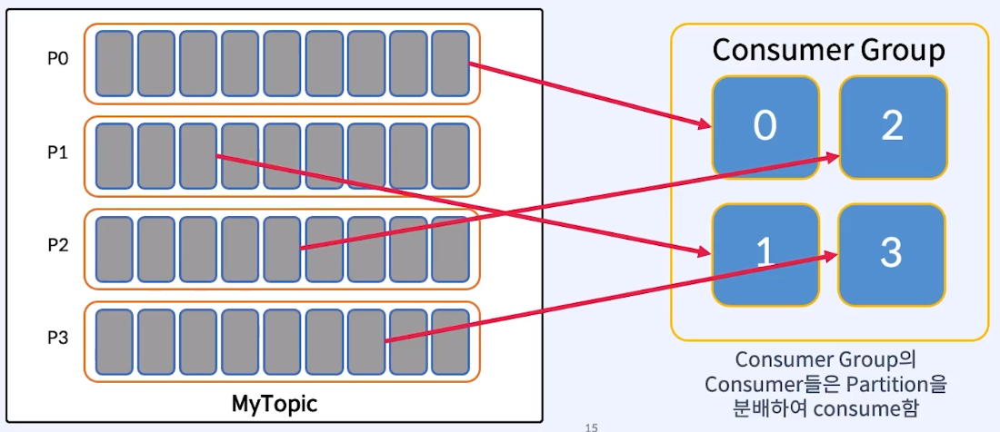

# 05. Consumer

## 1. Consumer 란?

> Kafka의 Partition으로부터 **Record를 가져오는 Application**

 

- `Consumer`는 각각의 고유 속도로 `Partition(Commit Log)`에서 `Read(Poll)` 수행
- 다른 `Consumer Group`에 속한 `Consumer`들은 서로 관련 없으며, `Commit Log`에 있는 Event(Message)를 동시에 다른 위치에서 `Read`할 수 있음

 

---

 

## 2. Consumer Offset

- _`Consumer`가 읽을 **`다음 위치`** 표시 (다시 읽음을 방지)_
- `__consumer_offsets`라는 `Kafka`의 내부 `Internal Topic`에 `Offset`을 저장하고 관리 **(Consumer에 저장하지 않음)**

 

---

 

## 3. Consumer와 Partition의 Mapping

### 1) Consumer와 Partition의 1:N 관계

- **`1개의 Consumer`가 `N개의 Partition`을 `Consume`할 때**
- _각 `Partition`마다 별도로 `Offset`을 관리_

### 2) Consumer와 Partition의 N:M 관계

- **`N개의 Consumer(1개의 Consumer Group)`와 `M개의 Partition`이 존재할 때**
- _1개의 `Partition`은 각 `Consumer Group`마다 1개의 `Consumer`와 연결_
- _1개의 `Consumer`는 주어진 `Topic`에서 0개 이상의 `Partition`과 연결_

### 3) Consumer Group과 Partition의 N:M 관계

- _`Consumer Group`은 동일한 `group.id`를 가진 `Consumer`들의 집합_
- `Consumer Group`의 `Consumer`들은 작업량을 균등하게 분할 (1:1, N:M 연결 가능)
- `서로 다른 N개의 Consumer Group`이 `동일한 Topic`을 `Consume`할 수 있음
  - 각 `Consumer Group`은 서로 **독립**

 

---

 

## 4. Message Ordering (순서보장)

### 1) 전체 Message의 순서 보장 문제

- `Partition이 2개 이상`인 경우 **모든 메시지**에 대한 전체 **`순서 보장 불가능`**
- `Partition을 1개`로 구성하면 **모든 메시지**에서 전체 **`순서 보장 가능`**
  - 처리량 저하
  - 병렬 처리를 위한 `Kafka`의 목적과 다름
  - `Kafka`를 이용하여 **모든 메시지의 순서**를 보장하는 case가 **거의 없음**
  - 대부분 **Key로 구분된 메시지들**의 **순서 보장**이 필요
  - 예시
    - 모든 사용자의 클릭 이벤트 순서가 중요한가? vs 한 사용자의 클릭 이벤트 순서가 중요한가?

### 2) Key로 구분된 메시지들의 순서 보장

- **동일한 Key**를 가진 메시지는 `같은 Partition`에 전달되기 때문에 **해당 Partition안에서 순서 보장**
- 전체 Message의 순서와 상관 없이 **Key(Partition)별 순서 보장**
- 운영 중에 `Partition` 개수 변경 시, `Partitioner`의 `mod` 연산이 변경되기에 순서가 보장되지 않음
- `Partition` 전체에 Message를 고르게 배포하는 `Key` 선정이 중요
  - 부하 분산과 연관

 

---

 

## 5. Consumer Failure (Rebalancing)

- _`Consumer Group`내의 한 `Consumer`가 장애난다면, 다른 Consumer와 연결하도록 `Rebalancing` 진행_
- `Rebalancing` 진행 시, 조건을 만족하여 다른 `Consumer`와 연결
  - **_1개의 Partition은 각 Consumer Group마다 1개의 Consumer와 연결_**
  - **_1개의 Consumer는 0개 이상의 Partition과 연결_**
