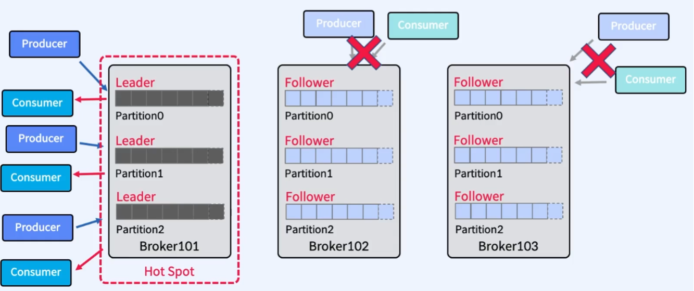

# 06. Replication

 

## 1. 장애를 대비하기 위한 Partition 복제(Replication)

 

- [문제점]  
  한 Broker에서 장애 발생 시, 장애 난 Broker에 있는 모든 Partition의 메시지와 Offset 정보가 버려진다 (가용성 문제)

 

- [해결책]  
   **다른 Broker에 복제물(Replicas)을 만들어 장애를 대비**

  > `Leader` Partition : 원본 Partition  
  > `Follower` Partition : 복제된 Partition (Replica라고도 부르며, 단순히 장애를 대비하기 위한 존재)  
  > `Replication Factor = 3`은 `Leader` Partition 1개와 `Follower` partition 2개 구성하는 것은 의미

 

- [복제 과정]  
   Producer가 `Leader` Partition에 원본 Message를 담고 `Follower` Partition이 `Leader` Partition의 Message를 복사
  - `Follower`가 `Leader`의 Data를 복사하기 위해 요청(`Fetch Request`) 한다.

 

- [참고]  
  일반적으로 `Producer/Consumer`는 `Leader`에서 Write/Read 한다.
  - Apache Kafka 2.4부터 Consumer가 Follower에서도 Read할 수 있음(`Follower Fetching`)

 

---

 

## 2. Leader에서 장애가 난다면?

> 새로운 Leader 선출

- Leader Partition에서 장애 발생 시 아래와 같은 순서가 진행
  1. Kafka Cluster가 새로운 Leader 선출
  2. Clients(Producer/Consumer)는 자동으로 새 Leader Partition으로 전환(balancing)
  3. Follower는 새로운 Leader로부터 복사 Request를 보냄

 

---

 

## 3. Leader Partition 자동 분산

> Hot Spot 방지 (부하 방지)

 

### 1) 문제점 - `부하 집중`

 

- 여러 개의 Topic이 존재하고 하나의 Broker에만 Leader Partition을 구성한다면?
  - 한 곳에서만 Data를 주고 받음 (부하 집중)
  - CPU 사용률 높아짐
  - Disk I/O 높아짐

 

### 2) 자동 Leader 분산

 

- Hot Spot(부하 집중)을 방지하기 위해 Rebalancing을 유발하는 여러 Option이 있음
  - `auto.leader.rebalance.enable` : `enable` (default)
  - `leader.imbalance.check.interval.seconds` : `300sec` (default)
    - 300초마다 Leader의 불균형이 있는지 Check
  - `leader.imbalance.per.broker.percentage` : `10` (default)
    - 다른 Broker보다 10%이상 사용되는 불균형이 있는지 Check

 

### 3) 물리 장비인 Rack 전체에 장애 발생

- Rack간 분산을 통해 Rack 장애를 대비
- 동일한 Rack 또는 Available Zone 상의 Broker들에 동일한 `Rack Name` 지정
- Replica(복제본)는 균형을 유지하며 분산 (Rack Awareness 기능, Rack 장애 대비)
