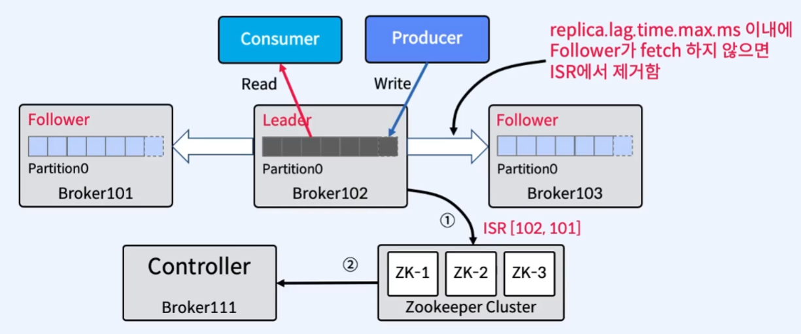

# 07. In-Sync Replicas(ISR)

## 1. In-Sync Replicas(ISR)이란?

 

- `In-Sync Replicas(ISR)`란, `High Water Mark`라는 지점까지 복사된(Sync를 맞춘) `Leader`와 `Follower`들의 목록으로, `Leader`에서 장애 발생 시 새로운 Leader를 선출하기 위한 후보 리스트
  - `High Water Mark`란, Follower가 가장 최근 메시지를 복제(Committed)한 위치
    - 여기서의 Commit은 Kafka 내부에서 사용
    - Leader가 내부적으로 복제가 완료되었다는 Commit을 남김
  - `replica.lag.max.messages`는 복제가 지연되었다고 판단되어지는 Leader와 Follower간의 지연된 메시지 개수
- **Leader에서 장애가 발생하면, ISR 중에서 새 Leader를 선출**

 

- `replica.lag.max.messages`로 ISR 판단 시 나타나는 문제점

  - `replica.lag.max.messages = 5`에서 초당 3개의 Message (3msg/sec)가 일정하게 Kafka로 들어온다면, 지연되는 Message가 없으므로 ISR이 정상 동작
  - 만약, 메시지 유입량이 순간적으로 늘어난다면(10msg/sec), 지연되었다고 판단하여 OSR(Out-of-Sync Replicas)로 상태 변경
  - Follower는 정상적으로 작동하고 있고 잠깐 지연이 발생할 뿐인데 OSR로 판단되어 불필요한 error 발생과 retry를 유발
  - `replica.lag.time.max.ms`로 대체

 

- `replica.lag.time.max.ms`
  - Follower가 Leader로 Fetch요청을 보내는 `Interval`을 체크
  - 예를 들어, `replica.lag.time.max.ms = 10000`라면, Follwer가 10000ms 내에 Leader에게 Fetch요청을 보내면 정상으로 판단
  - Confluent에서는 해당 옵션만 제공

 

---

 

## 2. ISR은 누가 관리하나?

 

- Leader Partition을 가지고 있는 Broker가 관리
  - Follower가 너무 느리면, Broker가 ISR에서 Follower를 제거하고 Zookeeper에 전달
  - Controller는 Zookeeper로부터 Partition Metadata에 대한 변경 사항을 수신

 

---

 

## 3. Controller란?

- Kafka Cluster내의 하나의 Broker가 Controller 역할을 함
- Controller는 Zookeeper를 통해 Broker Liveness(장애여부, 변동사항)를 모니터링
- Controller는 Leader와 Replica 정보를 Cluster내의 다른 Broker들에게 전달
  - 다른 Broker에게 전달하는 이유는 Zookeeper에 Replicas 정보의 복사본을 유지한 다음 더 빠른 액세스를 위해 클러스터의 모든 Broker들에게 동일한 정보를 Caching
  - Caching을 통해 속도를 높이기 위함
- Controller는 Leader 장애 시, 새로운 Leader 선출을 수행
- Controller에서 장애 발생 시, 다른 Active Broker에서 Controller 재선출

 

---

 

## 4. Consumser와 관련된 Position

 

- `Last Committed Offset(Current Offset)` : Consumer가 최종 Commit한 Offset
- `Current Position` : Consumer가 읽어간 위치(아직 처리 중, Commit 전)
- `High Water Mark(Committed)` : ISR(Leader-Follower)간에 복제된 Offset
- `Log End Offset` : 마지막 메시지(Log의 맨 끝 Offset)
- `Consumer Lag` : 마지막 메시지와 Consumer가 읽어간 메시지와의 차이

 

---

 

## 5. Committed의 의미

 

- **ISR 목록의 모든 Replicas가 성공적으로 메시지를 가져오면 `Committed`되었다 한다.**
- Consumer는 Committed 메시지만 읽을 수 있음
- Leader는 메시지를 Commit할 시기 결정
- Committed 메시지는 모든 Follower에서 동일한 Offset을 갖도록 보장
  - 장애가 발생하더라도 어떤 Replica든 같은 Offset에서 데이터를 볼 수 있음
- Broker가 다시 시작할 때 Committed 메시지 목록을 유지하기 위해

 

---

 

## 6. Leader Epoch

- 새 Leader가 선출된 시점을 Offset으로 표시
- Broker 복구 중에 메시지를 체크포인트로 자른 다음 현재 Leader를 따르기 위해 사용됨
- Controller가 새 Leader를 선택하면 Leader Epoch를 업데이트하고 해당 정보를 ISR 목록의 모든 구성원에게 보냄
- leader-epoch-checkpoint 파일에 체크포인트를 기록

 

---

 

## 7. Message Commit 과정

 

> Fetcher Thread는 새로운 Data를 받기 위해 주기적으로 Leader에게 요청
