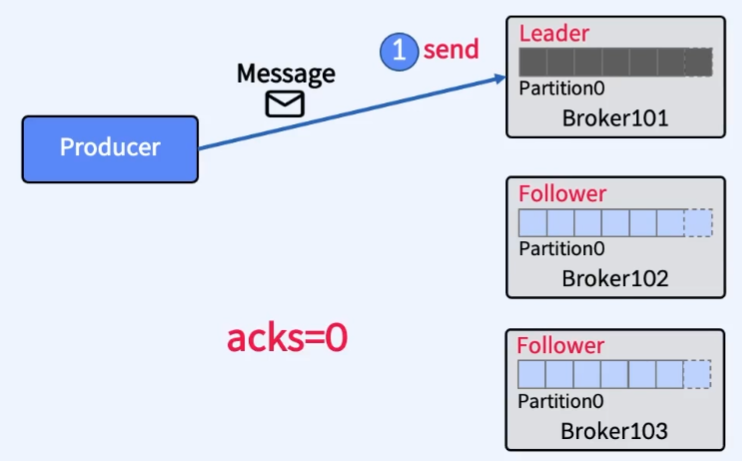
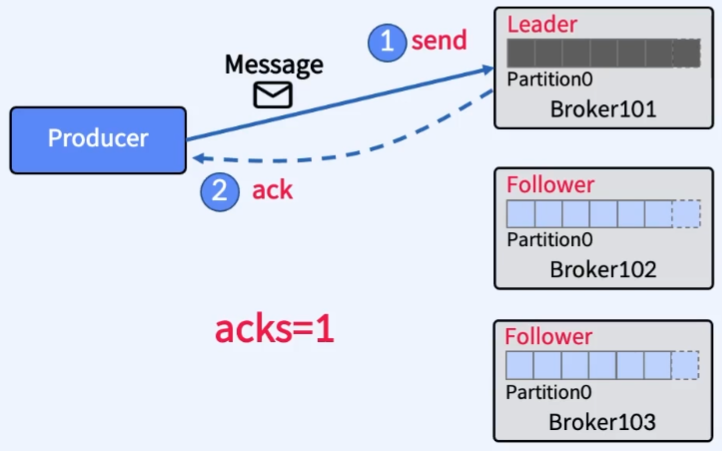
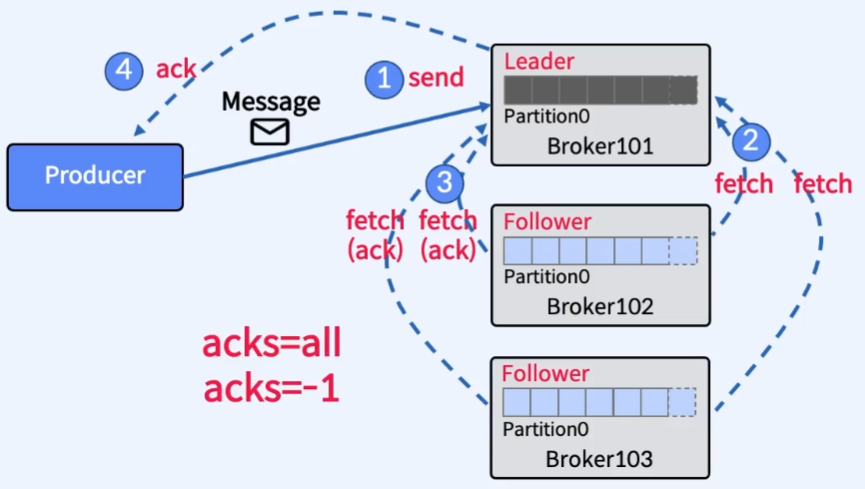
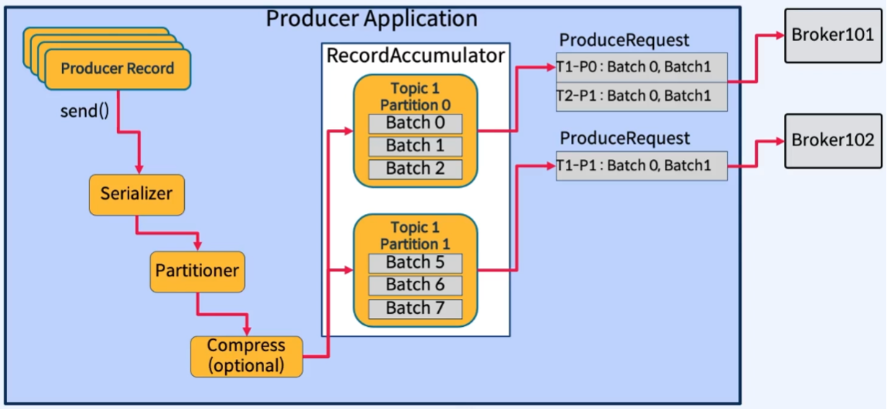
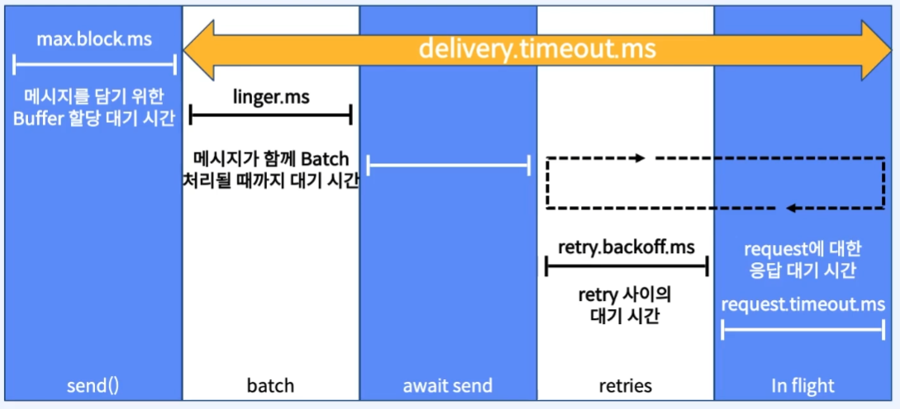
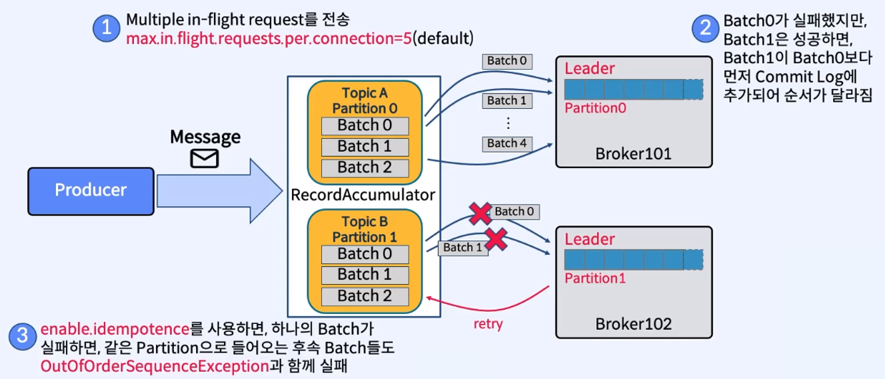

bbㅠbㅠ# 01. Producer Acks, Batch, Page Cache, Flush

## 1. Pruducer는 Kafka가 Message를 잘 받았는지 어떻게 알까?

> acks

### acks란?

- ack는 Producer에서 Kafka로 Message를 전송했을 때, 어떤식으로 동작할 건지 나타내는 Producer의 Parameter 중 하나
- **acks = 0**
  
  - ack가 필요하지 않음
  - Kafka가 잘 받았는지 확인하지 않음
  - 자주 사용되지 않음
  - 메시지 손실이 발생할 수 있음
  - 빠른 메시지 전송이 필요할 때 사용
- **acks = 1 (default)**
  
  - Leader가 메시지를 수신하면 ack를 보냄
  - Leader가 Producer에게 ack를 보낸 후 Follower가 복사하는 과정에서 Leader에 장애가 발생하면 복사를 하지 못해 메시지 손실이 날 수 있음
  - **At most once (최대 한 번) 전송 보장**
- **acks = -1, acks=all**
  
  - Leader부터 Follower의 Replica까지 메시지가 모두 Commit되면 ack를 보냄
  - Leader가 장애나도 데이터가 살아남을 수 있도록 보장
  - acks=0, acks=1 보다 대기 시간이 길어짐
  - 실패 시 반복될 수 있음
  - **At least once (최소 한 번) 전송 보장**

 

---

 

## 2. Producer의 재전송

> retry

### retry란?

- 이전에 보낸 메시지의 전송이 실패할 때, 다시 전송하는 기능
- 재시도(retry)는 N/W 또는 시스템의 일시적인 오류를 보완하기 위해 모든 환경에서 중요

| Parameter             | 설명                                            | Default 값 |
| --------------------- | ----------------------------------------------- | ---------- |
| `retries`             | 메시지를 send하기 위해 재시도하는 횟수          | MAX_INT    |
| `retry.backoff.ms`    | 재시도 사이에 추가되는 대기 시간                | 100        |
| `request.timeout.ms`  | Producer가 응답을 기다리는 최대 시간            | 30초       |
| `delivery.timeout.ms` | send() 후 성공 또는 실패를 보고하는 시간의 상한 | 2분        |

- retries를 조정하는 대신에 delivery.timeout.ms 조정으로 재시도 동작을 제어
- _acks=0에서 retry는 무의미_

 

---

 

## 3. Producer Batch 처리

> 메시지를 모아서 한번에 전송

- Batch 처리는 RPC(Remote Procedure Call)수를 줄여서 Broker가 처리하는 작업이 줄어들기 때문에 더 나은 처리량 제공
  - 100명이 이동하는데, 각자 택시타고 이동하는게 효율적인가? 아니면 버스타고 이동하는게 효율적인가?
- Batch 처리를 위한 Parameter
  | Parameter | 설명 | Default 값 |
  | --- | --- | --- |
  | linger.ms | 다음 Batch(메시지 모음)들을 보내기 위한 대기 시간 | 0 (즉시보냄) |
  | batch.size | 보내기 전 Batch의 최대 크기 | 16KB |
  - Batch 처리의 일반적인 설정은 linger.ms=100 및 batch.size=1000000

 

---

 

## 4. Producer가 생성한 Message의 Send Life Cycle

 

---

 

## 5. Message Send의 순서 보장

> enable.idempotence

 

- **문제점**: 진행 중(in-flight)인 여러 요청을 재시도하면 순서가 바뀔 수 있음

> 시나리오
>
> 1. 한 번에 보낼 batch 파일의 개수 옵션인 `max.in.flight.request.per.connection=5(default)`를 설정
> 2. batch0 ~ batch4가 동시에 send
> 3. 만약 batch0의 전송이 실패한다면, batch0에 대한 retry를 진행하기 때문에 batch1보다 나중에 Commit (순서 역전)

- `enable.idempotence`를 사용하면, 하나의 Batch가 실패할 때 같은 Partition으로 들어오는 후속 Batch들도 `OutOfOrderSequenceException`을 내며 실패되며 다시 retry 진행

 

---

 

## 6. Page Cache와 Flush

- Message는 Partition에 기록됨
- Partition은 Log Segment File로 구성 (default: 1GB마다 새로운 Segment File 생성)
- **성능을 위해 `Log Segment`는 `OS Page Cache`에 기록됨**
- 로그 파일에 저장된 메시지의 데이터 형식(Byte-Array)은 `Producer`가 `Broker`에게 보낸 형식과 `Broker`로부터 `Consumer`가 가져가는 형식이 동일하므로 `Zero-Copy` 가능
  > **Zero-Copy란?**  
  > Broker는 Java Process이기에 User Sapce의 Heap 메모리를 사용할 수 있어 Heap 메모리를 거친 후 OS Page Cache로 전달(저장) 할 수 있다. 하지만, Kafka는 **성능 향상(Heap 메모리 절약, 엄청난 처리량)** 을 위해 Heap 메모리를 거친 후 OS Page Cache에 저장하는 것이 아니라 **CPU의 개입 없이 N/W Buffer에서 OS Page Cache로 직접 전송하는데 이를 Zero-Copy라 한다.**
  >
  > \* 참고) Heap 메모리에 적재하기 위해선 CPU의 개입이 필요
- Page Cache는 다음 2가지 경우에 Disk로 Flush
  - Broker가 완전히 종료된 경우
  - OS Backgroud의 `Flusher Thread` 실행 (OS 레벨에서 자동으로 진행)

 

> **만약, Flush 되기 전 Broker에 장애가 발생하면?**
>
> 이를 대비하기 위해 Replication을 진행. Replication이 없다면, 데이터는 영구적으로 손실된다. 하지만 Replication이 있다면, 장애가 발생한 Broker가 정상으로 돌아온되면 필요에 따라 재선정된 Leader Partition으로부터 데이터가 복구된다.

 

> [참고]
>
> 1. Kafka에는 자체적으로 메시지 수나 시간 등을 설정할 수 있는 Flush 정책이 있다. 하지만, Kafka는 운영체제에게 Flush 정책을 맡기는 것을 선호하기에 Flush 설정은 default로 놓고 건드리지 않는 것을 권장한다.
> 2. \*.log 파일을 보면 Disk로 Flush된 데이터와 아직 Flush되지 않은 데이터가 모두 표시된다. Flush된 데이터를 구분해주는 Linux 도구(ex. vmtouch)도 있다.
