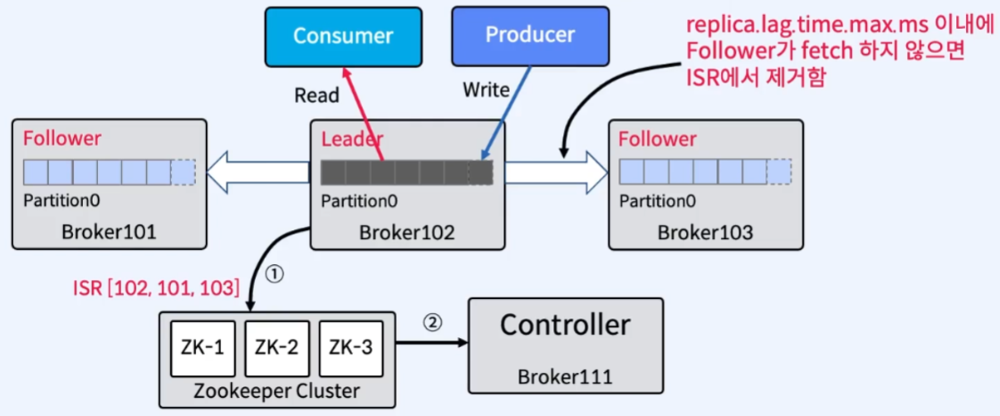
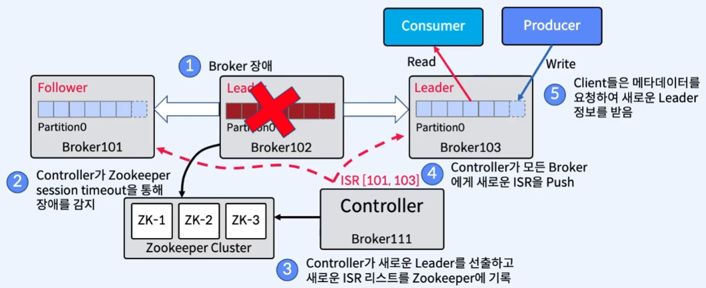
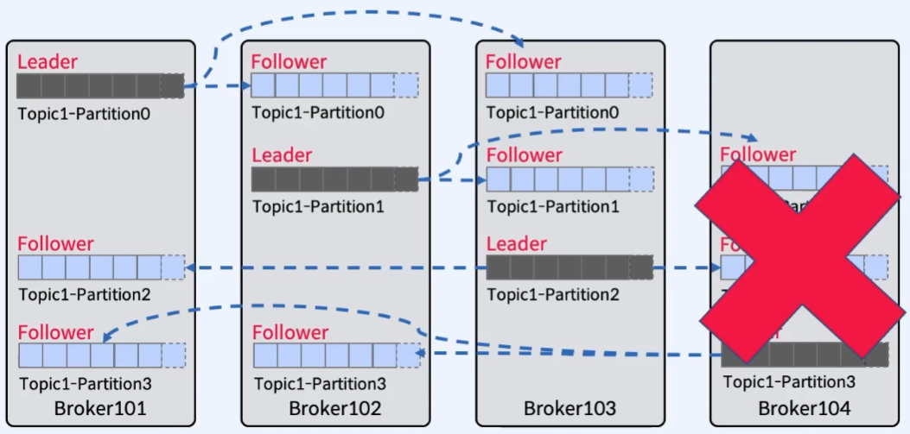

# Replica Failure

## 1. In-Sync Replicas(ISR) 리스트 관리

- ISR 리스트의 모든 Replica에 메시지가 복제되면, 해당 메시지는 Commit된 것으로 간주
- Zookeeper의 ISR 리스트에 대한 변경 사항은 Leader Partition이 담당
  - Follower가 실패하는 경우
    - Leader에 의해 ISR 리스트에서 삭제
    - Leader는 새로운 ISR을 구성하여 Commit
  - Leader가 실패하는 경우
    - Controller는 Follower 중 새로운 Leader를 선출
    - Controller는 새 Leader와 ISR 정보를 Zookeeper에 전달한 후, 전체 Broker에 공유하여 Local Caching
- n개의 Replica가 있는 경우 n-1개의 장애를 허용(n=3인 경우, 2개까지 장애를 허용)

 

---

 

## 2. ISR은 Leader가 관리

> Leader가 Zookeeper에 ISR을 Update, Controller는 Zookeeper로부터 정보를 수신

 

### 1) ISR 업데이트 과정

1. Follower의 Fetch(복사) 속도가 너무 느리면 Leader는 ISR에서 Follower를 제거하고 Zookeeper에 ISR 정보를 갱신한다.

   - `replica.lag.time.max.ms` 이내에 fetch하지 않으면 ISR에서 제거

2. Zookeeper는 Controller에게 Partition Metadata의 변경 사항을 공유한다.

 

---

 

## 3. Failure가 발생한 경우

### 1) Leader Failure

1. Leader Partition 장애 발생
2. Zookeeper가 Session timeout을 통해 해당 Leader Partition의 장애 감지. 그리고 장애 정보를 Controller에게 공유
3. Controller가 새로운 Leader를 선출하고 새로운 ISR 리스트를 Zookeeper에 기록
4. Controller가 Zookeeper에 공유한 새로운 ISR 리스트를 Kafka Cluster에 있는 모든 Broker에게 전달
5. Client(Producer, Consumer)들은 메타데이터를 요청하여 새로운 Leader 정보를 얻음

> [참고]
>
> **`Leader Partition`이 없으면, `Leader`가 선출될 때까지 해당 `Partition`을 사용할 수 없다.** `Leader`가 없는 상태에서 `Producer`가 `send()` 한다면, **retries 파라미터** 설정에 따라 **재시도**를 한다. 만약 `retries=0` 이라면, `Leader`가 없어 응답을 할 수 없음으로 `NetworkException`이 발생한다.

 

### 2) Broker Failure

> 예시: Broker 4개, partition 4개, Replication Factor=3인 경우에서 Broker104 장애 발생

[시나리오]

1. Broker104에서 장애 발생
2. 각 Partition별 영향 검사
   - `Partition0` : 장애 없음
   - `Partition1` : Follower 1개에 장애가 발생했으나 **장애 허용 정책(n-1개까지 허용)** 에 의해 문제가 발생하지 않음
   - `Partition2` : Follower 1개에 장애가 발생했으나 **장애 허용 정책(n-1개까지 허용)** 에 의해 문제가 발생하지 않음
   - `Partition3` : Leader에 장애가 발생했음으로, Follower 중 하나가 Leader로 승격

 

---

 
