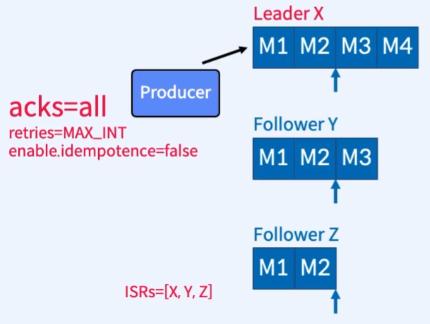
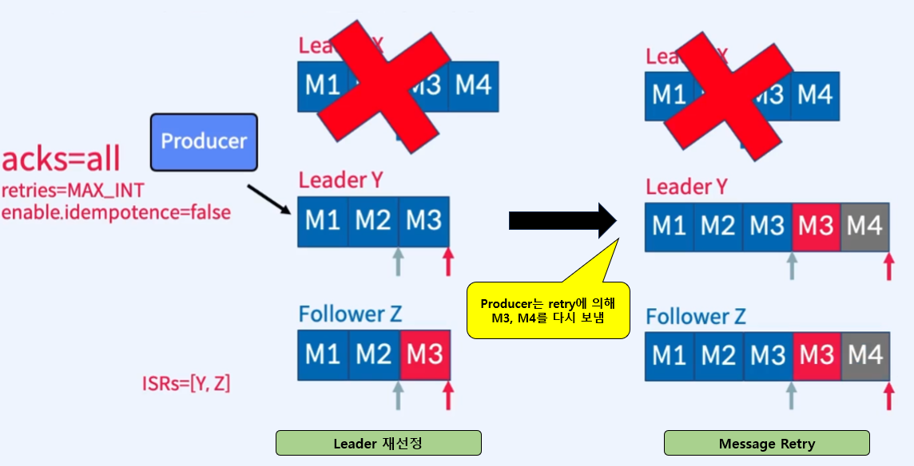
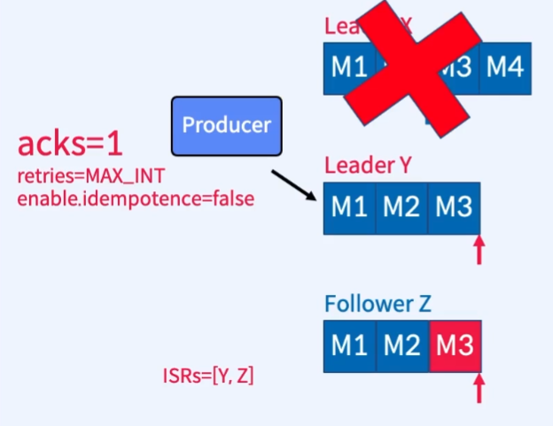
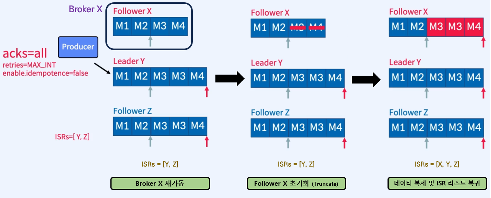

# 3. Replica Recovery

## 01. 정상 작동되는 Kafka의 복구 과정

> `acks=all` 의 중요성

</br>



</br>

[예시에 사용된 설정]

```java
- acks = all                  // send() 후 복사가 완료되야 response 전송
- enable.idempotence = false  // send() 시 장애가 발생해도 batch 순서 보장하지 않음
```

</br>

[정상 Replica 과정]

1. Producer가 M1~M4 메시지를 순차적으로 send()
2. M1, M2 메시지가 모든 replica에 복제됨
   - High Water Mark를 만족하기에 모든 Follower는 ISR 리스트에 속함. ISRs=[X, Y, Z]
3. Follower Y는 M3를 복제했지만, Commit은 하지 못함
4. Foloower Z는 M2까지만 복제

</br>

---

</br>

## 02. Leader Partition이 속한 Broker X에 장애가 발생한다면?

</br>



</br>

### 1) Leader Partition이 존재한 Broker X에서 장애 발생 시, 복구 과정

> 가정: M3, M4 메시지가 Commit 되기 전에 장애 발생

</br>

1. Controller가 ISR 리스트에서 가장 많이 Commit된 Follower Y를 새로운 Leader로 선출
2. Leader Epoch가 0에서 1로 증가
3. Follower Z가 M3 메시지를 fetch
4. Leader Y는 High Water Mark를 갱신
5. Follower Z가 다시 fetch하여 High Water Mark를 갱신

   > **참고**
   >
   > Q: Leader Partition Y는 M3를 fetch 했었지만 M2까지 High Water Mark를 찍었기 때문에 Commit하지 못했다. 그럼에도 불구하고 Y Partition은 M3를 보존한 채로 Leader가 될 수 있었을까?
   >
   > A: Leader로된 Partition은 데이터를 지우지 않는다. 그리하여 Y Partition이 새로운 Leader로 선출되었기 때문에 Commit이 안된 상태여도 M3까지 품은 뒤 새로운 데이터를 수신한다.

6. Producer는 M3, M4 메시지에 대한 `ack`를 받지 못했기 때문에 `retry` 진행
7. `idempotence=false` 옵션으로 인하여 M3 메시지는 중복 발생
8. Follower Z도 fetch를 진행하여 Leader와 똑같이 M3 메시지 중복 발생
9. Follower Z는 다시 fetch하여 High Water Mark를 갱신

</br>

### 2) 위 복구 과정에서 `acks=1`이라면, M4 메시지는 어떻게 될까?

> 메시지 손실이 발생함으로 `acks=1` 설정은 위험

</br>



</br>

[복구 과정]

1. `Producer`가 M1 ~ M4 메시지를 `send()` 후 `Kafka`로부터 성공적으로 전송됐다는 `ack` 응답을 받음
2. `Kafka`에서 1)의 과정과 같이 M3, M4가 `Commit`되기 전에 장애 발생
3. M3 메시지까지는 1)의 `ack=all`일 때와 동일하게 복구 진행
4. 하지만, `Producer`가 M4 메시지에 대한 `ack`를 받았기에 `retry`를 진행하지 않음
5. _**M4 메시지의 영구 손실 발생**_

</br>

---

</br>

## 03. 장애난 Broker X가 다시 재가동되었다면?

> 해당 `Topic`의 `Partition`은 `Follower`가 되어 `Leader`로부터 데이터를 복제

</br>



</br>

[복구 과정]

1. `Broker X`가 복구되면 `Zookeeper`에 연결
2. `Broker X`는 `Controller`부터 metadata 공유 받음
3. `Broker X`에 있는 `Partition X`는 `Follower`가되어 `Leader`로부터 `Leader Epoch`를 fetch
4. `Follower X`는 `Leader`가 변경된 시점(M2 이후)부터 데이터 정합성을 위해 _**`초기화 진행(Truncate)`**_
5. `Follower X`는 `Leader`로부터 데이터 복제
6. `Follower X`는 복제가 발생한 순간 `ISR 리스트`에 복귀

</br>

---

</br>

## 04. 가용성(Availability)과 내구성(Durability)

</br>

### 1) Topic의 옵션

- `unclean.leader.election.enable`

  - `ISR 리스트`에 없는 Replica를 `Leader`로 선출할 것인지에 대한 옵션 `(default: false)`
    - `ISR 리스트`에 Replica가 하나도 없다면 => `Leader` 선출을 안하고 서비스 중단
    - `ISR 리스트`에 없는 Replica를 `Leader`로 선출한다면 => 데이터 유실

  </br>

  > _[참고]_  
  > _`ISR 리스트`를 사용하는 이유: `Leader Partition`에 장애 발생 시 최대한 데이터 유실을 방지하면서 `Leader`를 재선출하기 위함_

- `min.insync.replicas`
  - 최소 요구되는 ISR의 개수에 대한 옵션 `(default: 1)`
    - `min.insync.replicas=1`이라면, `Leader Partition`만 정상 작동하면 된다는 의미
    - 흔히 `min.insync.replicas=2`를 사용
  - ISR이 `min.insync.replicas`보다 적은 경우, `producer`는
    `NotEnoughReplicas Exception` 수신
  - _**`acks=all` 옵션과 `min.insync.replicas=2`를 함께 사용할 때 더 강력한 Recovery 보장**_
  - `N개`의 `Replica`가 있고 `min.insync.replicas=2`인 경우, `N-2`개의 장애를 허용할 수 있음
    - ex) `N=3`인 경우, 2대가 정상 작동되어야 한다.

</br>

### 2) 상황별 옵션 권장 설정

- 데이터 유실을 없애려면?
  - `Topic` : `replication.factor`는 `2`이상 **(최소 3이상)**
  - `Topic` : `min.insync.replicas`는 `1`이상 **(최소 2이상)**
  - `Producer` : **`acks=all`**
- 데이터 유실이 다소 있더라도 가용성을 높이려면?
  - `Topic` : `unclean.leader.election.enable=true`
