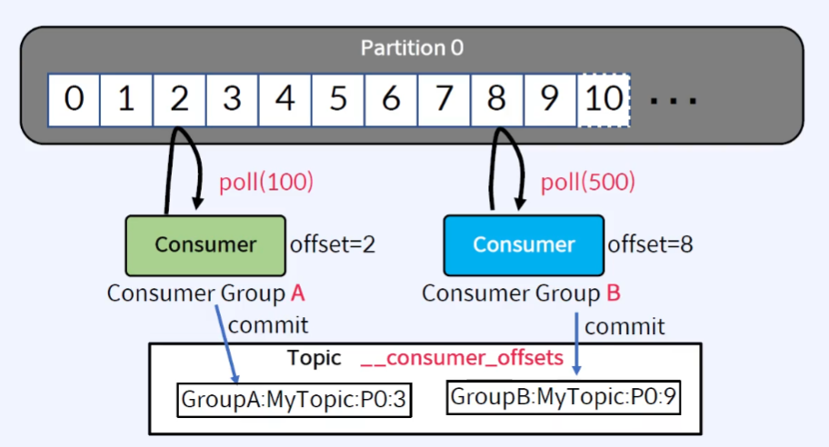
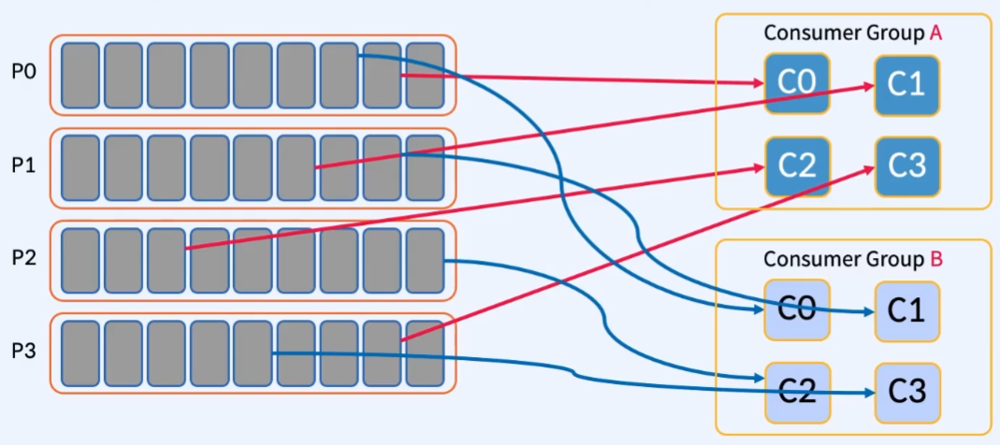

# Consumer Rebalance

## 01. Consumer의 동작 방식

> Partiton에서 메시지를 Polling

 

 

- Consumer는 Partition으로부터 Message를 Poll
- Tpoic마다 `__consumer_offsets`라는 offset 정보를 이용하여 마지막으로 가져온 위치 저장
- 1개의 Partition에 2개의 Consumer Group이 연결되었다면, 각 Consumer Group마다 따로 관리

 

---

 

## 02. Consumer Group

 

 

- Consumer들은 동일한 `group.id`로부터 Consumer Group을 형성
- Consumer Group의 Consumer들은 작업량을 어느 정도 균등하게 분할
- 동일한 Topic을 Consumer하는 여러 Consumer Group이 존재할 수 있음
  - 각 Consumer Group들은 독립적으로 작동

 

---

 

## 03. Partitoin과 Consumer의 관계

- `1개의 Partition`은 `Consumer Group` 당 `1개의 Consumer`와 연결
- 동일한 `Key`를 가진 Message는 `동일한 Consumer`가 `Consume`
  - _단, Partition 수가 변경되지 않아야 한다_
- `Consumer`의 설정 파라미터 중, `partiton.assignment.startegy`로 할당 방식 조정
- `Consumer Group`은 _**`Group Coordinator`**_ 라는 프로세스에 의해 관리

 

---

 

## 04. Consumer Group이 Partition을 할당하는 과정

### 1) Consumer 등록 및 Group Coordinator 선택

 

 - Consumer 등록 및 Group Coordinator 선택")

 

- 6개의 Partition과 7개의 Consumer로 구성된 하나의 Consumer Group
  - Partiton 개수  

### 2) JoinGroup 요청 순서에 따라 Consumer 나열

 

 - JoinGroup 요청")

 

- Consumer들은 Kafka Cluster에 등록할 때 Kafka(Group Coordinator)에게 JoinGroup 요청을 보낸다
  - Group Coordinator는 `group.initial.rebalance.delay.ms (default: 3초)` 동안 대기
- Group Coordinator은 JoinGroup 요청을 보낸 순서대로 Consume할 수 있는 최대 Partition 수까지 나열

 

### 3) Group Leader 결정 및 Partition 할당

 

 - Partition 할당")

 

- JoinGroup 요청을 보내는 최초 Consumer는 Group Leader로 지정
- Group Leader는 Group Coordinator로부터 Consumer 목록을 받음
- Group Leader는 `partition.assignment.strategy`를 이용하여 Conumser에게 Partition 할당
  - `partition 개수 < Consumer 개수` : 현 예시와 같은 상황으로 사용하지 않는(rest) Consumer가 발생
  - `partition 개수 > Consumer 개수` : Consumer가 여러 Partition과 연결될 수 있음

 

### 4) "Consumer -> Partition" 매핑 정보를 Group Coordinator에게 전달

 

 - Group Coordinator에게 할당 정보 전송")

 

- `Group Leader`는 "Consumer -> Partiton" 매핑 정보를 `Group Coordinator`에게 전달
- `Group Coordinator`는 매핑 정보를 Caching하고 `Zookeeper`에게 전달

 

### 5) 각 Consumer에게 할당된 Parition 정보를 보냄

 

 - Consumer에게 연결된 Parition 정보 전달")

 

- Group Coordinator는 각 Consumer에게 할당된 Partition 정보를 보냄
- 각 Consumer는 할당된 Partition에서 Consume 시작

> _**Q: 왜 Group Coordinator(Broker)가 직접 Partition을 할당하지 않는가?**  
> A: Kafka의 원칙 중 하나는 가능한 한 많은 계산을 Client에 수행하도록 하여 Broker의 부담을 줄임.  
> 수 많은 Consumer Group이 있을 때 Broker 혼자서 Rebalancing한다면 Pub-Sub과 동시에 많은 부담 발생_

 

---

 

## 05. 불필요한 Rebalancing은 피해야 한다

> Rebalancing 동안 메시지를 Consume할 수 없다

### 1) Rebalancing을 유발(Trigger)하는 행동

- Consumer Group에 새로운 Consumer 또는 기존 Consumer의 탈퇴
- Consumer가 Topic을 변경
- Consumer Group의 Topic 변경 사항 감지 (ex. Partition 증가)

### 2) Rebalancing 과정(process)

> Consumer가 빠지는 과정 (Join Request와 비슷하다)

1. Group Coordinator는 heartbeats를 이용하여 Consumer에게 rebalance 신호를 보냄
2. Consumer가 일시 중지하고 현재 진행한 offset을 commit
3. Consumer는 Consumer Group의 새로운 "Generation"에 다시 합류
4. Partition 재할당
5. Consumer는 새 Partition에서 다시 Consume

 

---

 

## 06. Heartbeats - Consumer의 장애 인지

> Broker가 Consumer의 장애를 파악할 수 있는 방법

- Consumer는 poll()과 별도로 백그라운드 Thread에서 Broker에게 Heartbeats를 보냄
  - `heartbeat.interval.ms (default: 3초)`
- 아래 시간 동안 Heartbeats가 수신되지 않으면 Consumer Group에서 해당 Consumer 삭제
  - `session.timeout.ms (default: 10초)`
- poll()은 Heartbeats와 상관없이 주기적으로 호출되어야 함
  - `max.poll.interval.ms (default: 5분)`

## 07. 과도한 Rebalancing을 피하는 방법

> 성능 최적화에 필수

- `Consumer Group` 멤버 고정
  - Group의 각 Consumer에게 고유한 `group.instance.id`를 할당
  - `Consumer`는 `LeaveGroupRequest`를 사용하지 않아야 함
  - `Rejoin(재가입)`은 알려진 `group.instance.id`에 대한 rebalance를 trigger하지 않음
- `session.timeout.ms` 튜닝
  - `heartbeat.interval.ms`를 `session.timeout.ms`의 1/3로 설정
  - `group.min.session.timeout.ms(default: 6초)`와 `group.max.session.timeout.ms(default: 5분)`의 사이값
  - 장점: `Consumer`가 `Rejoin`할 수 있는 더 많은 시간을 제공
  - 단점: `Consumer` 장애를 감지하는 데 시간이 오래 걸림
- `max.poll.interval.ms` 튜닝
  - Consumer에게 poll()한 데이터를 처리할 수 있는 충분한 시간 제공
  - 너무 크게 하면 안됨
